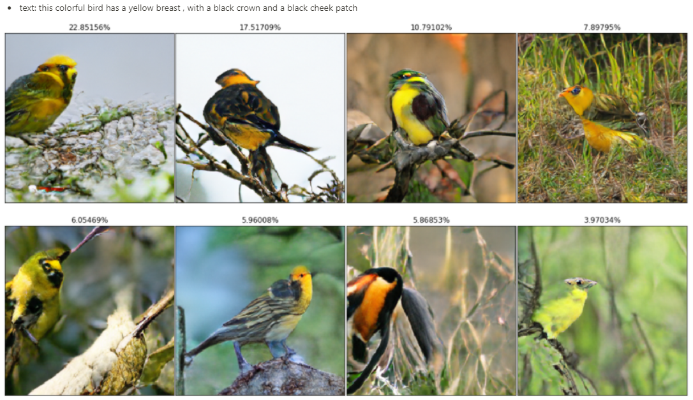
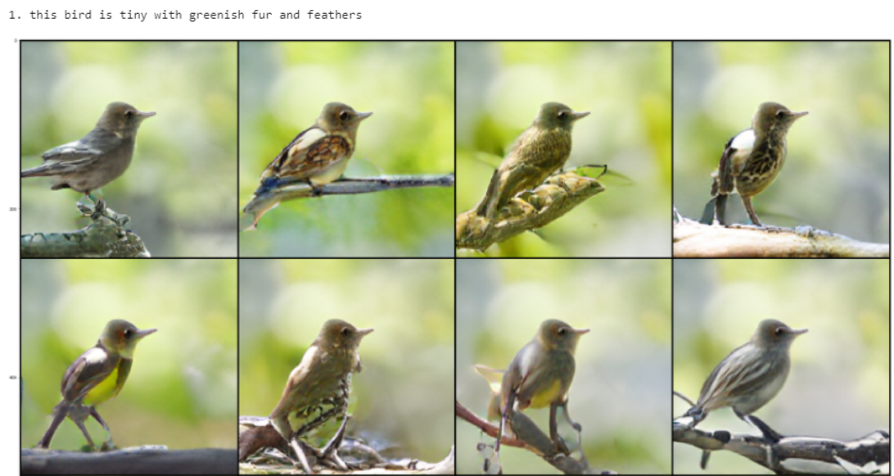

# DALLE-reproduction
This repository is for sharing pre-trained [DALLE](https://openai.com/blog/dall-e/) model and generating images from given texts.

All models are trained by [lucidrains/DALLE-pytorch](https://github.com/lucidrains/DALLE-pytorch) + [VQGAN (Taming transformer)](https://github.com/CompVis/taming-transformers) with different training code and BPE model.

If you want to train DALLE, please go to [lucidrains/DALLE-pytorch](https://github.com/lucidrains/DALLE-pytorch) and support them to reproduce better DALLE models ✈️

### The notebook includes
- Text to image generation

- Pre-trained CLIP reranking
</img>

- Generate rest of image based on the given cropped image
</img>

## Usage
1. Install requirements
```
$ pip install -r requirements
```

2. Install DeepSpeed
- Follow the instruction [here](https://github.com/lucidrains/DALLE-pytorch#deepspeed-sparse-attention) and install DeepSpeed

### Models
- Download models below and save them in *pretrained* folder
- Check [here](https://github.com/lucidrains/DALLE-pytorch/discussions/131) for the model specifics

Dataset | Download | Password | Details
-- | -- | -- | --
CUB200 | [link](https://dubox.com/s/1cBrzsPZ9WeBZ47OMlZV9rw) | v9ge | [Adam optimizer](https://github.com/lucidrains/DALLE-pytorch/discussions/131#discussion-3296648)
CUB200 | [link](https://dubox.com/s/1e3RTwdWYsKcs4RtKATfQNg) | 47w1 | [AdamW optimizer](https://github.com/lucidrains/DALLE-pytorch/discussions/139#discussioncomment-560790)
